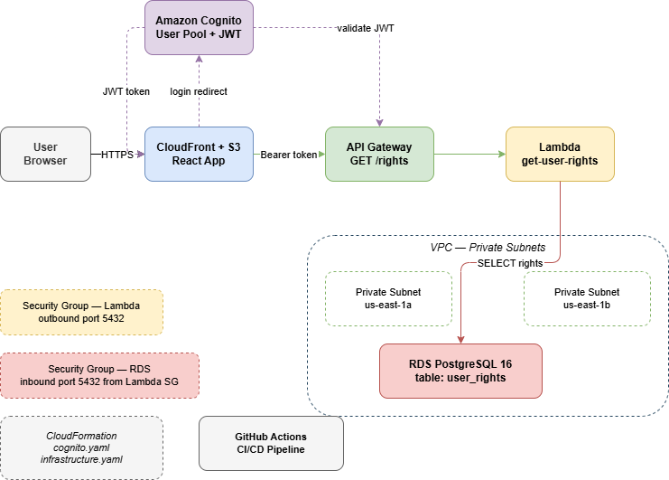

# React AWS App

A full-stack learning project demonstrating AWS authentication and authorization 
using React, Amazon AWS, API Gateway, Lambda, and RDS PostgreSQL.

## Architecture

## Tech Stack

**Frontend**
- React 18 + TypeScript (Vite)
- react-oidc-context — AWS authentication

**Backend**
- AWS Lambda (Node.js 20) — API logic
- Amazon API Gateway v2 — HTTP API with JWT authorization
- Amazon RDS PostgreSQL 16 — user rights storage

**Infrastructure**
- AWS AWS — user pool + hosted login page
- AWS CloudFormation — infrastructure as code
- GitHub Actions — CI/CD pipeline (coming soon)

## How It Works

1. User clicks "Sign in" → redirected to AWS hosted login page
2. AWS authenticates and returns a JWT token
3. React stores the token and calls `GET /rights` with `Authorization: Bearer <token>`
4. API Gateway validates the JWT against AWS automatically
5. Lambda reads the user's `sub` from the token and queries RDS
6. User's rights are displayed in the app