# Troubleshooting AWS Secrets Manager

When setting up the AWS Secrets Manager I had some issues connecting the lambdas to it. 

The Lambda instance is in the VPC, but it needs a way to reach Secrets Manager. Secrets Manager is an AWS service.

Private subnets don't have internet access. You need a VPC endpoint for Secrets Manager.

---

## 1. VPC endpoint creation
```bash
# Creation Secrets Manager VPC Endpoint
aws ec2 create-vpc-endpoint \
  --vpc-id vpc-[VPC_ID] \
  --service-name com.amazonaws.us-east-1.secretsmanager \
  --vpc-endpoint-type Interface \
  --subnet-ids <SUBNET_A_ID> <SUBNET_B_ID> \
  --security-group-ids <LAMBDA_SG_ID> \
  --private-dns-enabled \
  --region [REGION]

  aws ec2 describe-vpc-endpoints   --filters "Name=vpc-id,Values=vpc-[VPC_ID]"   --query "VpcEndpoints[*].[ServiceName,State]"   --output table   --region us-east-1
# ---------------------------------------------------------
# |                 DescribeVpcEndpoints                  |
# +------------------------------------------+------------+
# |  com.amazonaws.us-east-1.secretsmanager  |  available |
# +------------------------------------------+------------+

aws ec2 authorize-security-group-ingress \
  --group-id <LAMBDA_SG_ID> \
  --protocol tcp \
  --port 443 \
  --source-group <LAMBDA_SG_ID> \
  --region [REGION]
```
## 1. Explanation

API Gateway is a public AWS service that lives outside the VPC. The browser accesses it directly over the internet without entering the VPC. No endpoint is needed.

Lambda lives in a private subnet that has no direct access to the outside. RDS can access it directly (both are in the same subnet), but Secrets Manager is outside. Without a VPC endpoint, there is no way to access it.

The VPC endpoint acts like a private tunnel from your subnet directly to Secrets Manager without going through the internet.

